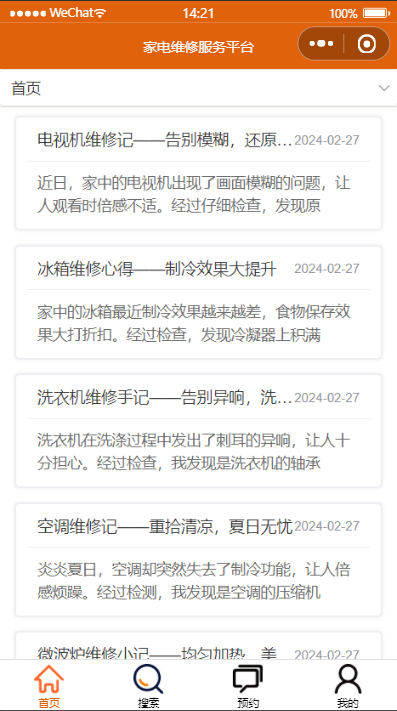
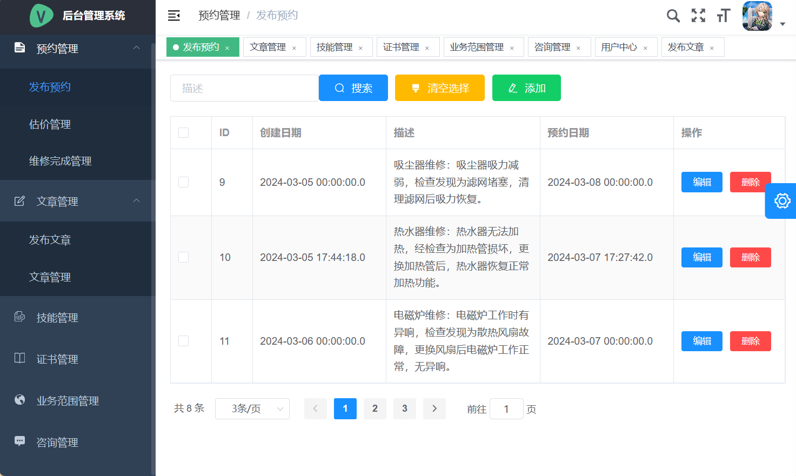
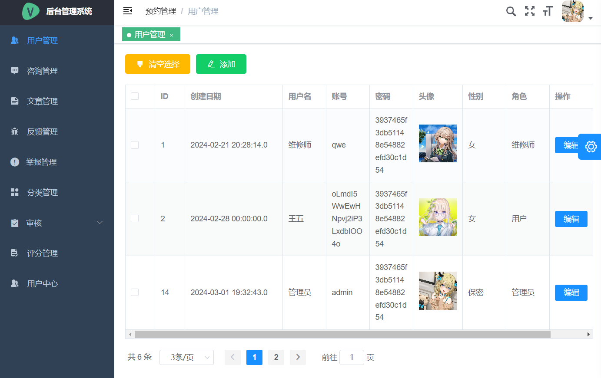

## 一、项目介绍

### 背景

​		传统家电维修服务过程中存在的信息不对称、效率低下、价值不透明、维修师技术水平参差不齐等问题。为了提高家电维修服务的效率和质量，设计并实现基于信息技术的家电维修服务管理系统，以解决维修收费不透明，维修师不专业等问题。系统采用先进技术和创新设计，促进用户与维修服务提供商的高效沟通。

### 界面展示

#### 微信小程序



#### 维修师



#### 管理员



## 二、功能

普通用户有如下功能：

- 登录：对用户进行账号管理。
- 咨询维修师：对维修师进行留言。
- 阅读文章：用户可以查看文章。
- 用户反馈：用户可以对小程序的功能进行返回说明。
- 举报：用户可以针对维修师进行举报，举报后由管理员进行管理。
- 针对某篇文章打赏：用户可以针对某篇文章打赏，表示对维修师的肯定。
- 搜索文章：输入关键字搜索。
- 对维修师评分：当维修师处理完成维修后，由用户确认并且打分，每个用户对每个维修师只能评分一次。
- 预约搜索维修师：可以针对城市搜索地址，也可以针对维修师名搜索。

维修师有如下功能：

- 技能管理：维修师可以维修哪些产品。
- 预约管理：针对用户的预约进行管理。
- 证书荣誉管理：维修师参加的比赛和证书。
- 文章管理：管理自己发布的文章信息
- 写关于维修方面的文章：可以针对某个分类标签写文章。
- 业务范围管理：维修师可以添加多个城市。
- 回复用户消息：维修师针对某个咨询进行回复。

管理员用户有如下功能：

- 用户管理：对维修师用户和管理员用户进行管理。
- 文章管理：对维修师写的文章进行管理。
- 用户反馈管理：用户反馈管理。
- 举报管理：举报消息管理。
- 分类管理：分类管理。
- 审核维修文章：审核管理员发布文章，审核不通过用户看不了。
- 审核维修师上传的技能证书：审核荣誉证书。
- 咨询消息管理：咨询消息管理。
- 评分信息管理：评分管理。

## 三、技术栈

### 后端

- Spring Boot 2.3.4
- MyBatis
- MySQL
- Spring Security认证授权
- Redis

### 前端

- Vue 2
- Uni-app
- Uni UI
- VUE-Element-Admin

## 四、启动

### 修改配置yml文件

```yml
spring:
  datasource:
    driver-class-name: com.mysql.jdbc.Driver
    type: com.alibaba.druid.pool.DruidDataSource
    # 修改自己的数据库地址
    url: xxx
    # 数据库的用户名
    username: xxx
    # 数据库密码
    password: xxx
  redis:
  	# 修改自己的redis地址
    host: xxx
    # 端口
    port: xxx
    # 密码，如果没有密码不写
    password: xxx
    database: 0 
```

### 启动项目

```shell
# 1、启动springboot项目
# 2、在maintain-admin打开终端，启动后台
npm run dev
# 3、在maintain-uniapp打开终端，启动小程序
npm run dev:mp-weixin
```

